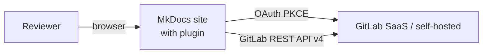
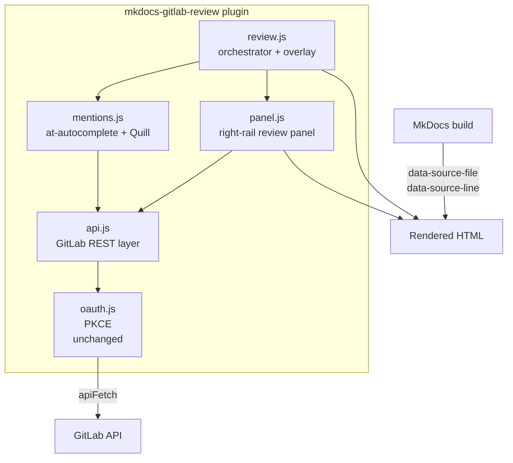
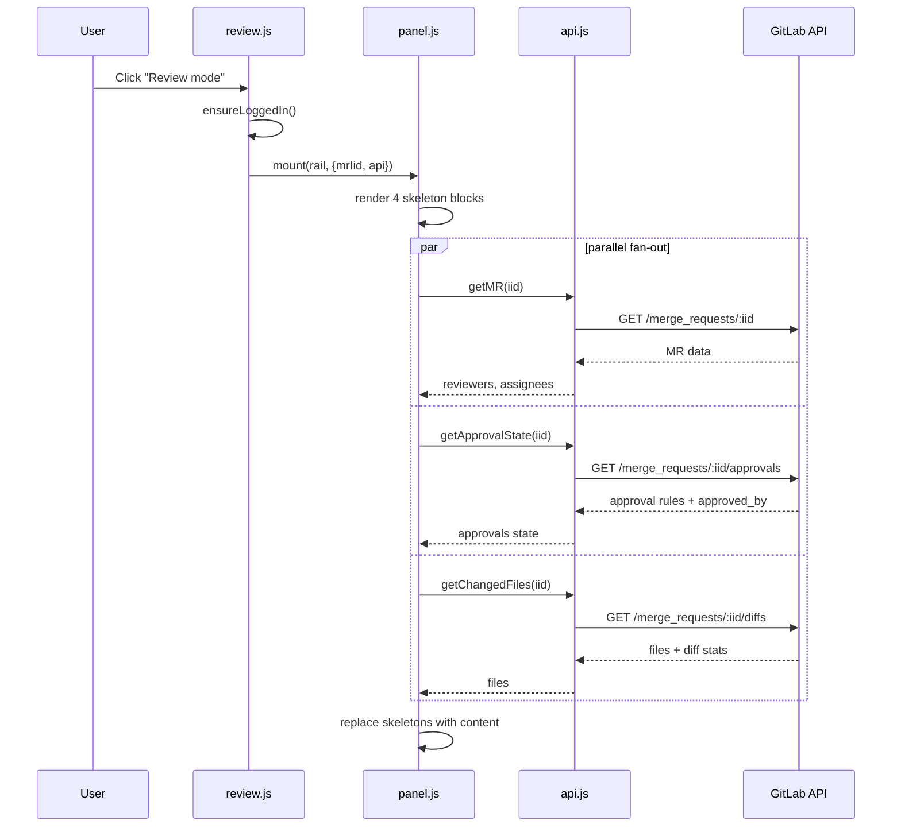
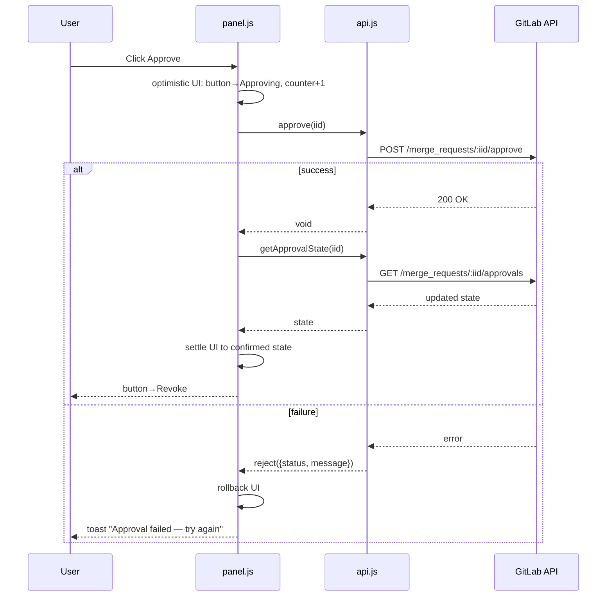

> Розширення плагіна `mkdocs-gitlab-review` (GitHub: `kh0ma/mkdocs-gitlab-review`).
> Додаємо GitHub-style review panel (Reviewers, Approvals, Changed Files, Assignees),
> виправляємо три баги в `@mention` автокомплітеві.

## Огляд

### Проблема

Плагін `mkdocs-gitlab-review` вже дозволяє залишати коментарі на відрендерених MkDocs сторінках у контексті GitLab MR. Проте під час фактичного рев'ю специфікацій (PRFAQ, Design Doc, ADR) рецензент мусить постійно перемикатися між докою і GitLab UI, щоб:

- побачити список змінених файлів
- зрозуміти, хто вже схвалив MR, а хто — ще ні
- запросити додаткового рецензента
- натиснути Approve

Крім того, `@mention` автокомпліт має три критичні баги, які роблять тегування колег майже непрацездатним:

1. Дропдаун виходить за межі контейнера редактора і часто рендериться за межами видимої області
2. Кирилиця ламає регекс-детекцію (`\w` не матчить українські літери) — введення `@о` після `@` закриває автокомпліт
3. Вставлена згадка `@username` рендериться в GitLab як простий текст без аватара і без клікабельного посилання на профіль

### Scope

Розширюємо інтерфейс плагіна, щоб переважна більшість рев'ю-дій виконувалась прямо на сторінці доки, не покидаючи MkDocs. Фіксимо баги `@mention`. Зберігаємо існуючу архітектуру (pure client-side + OAuth 2.0 PKCE) — жодних нових backend-сервісів.

---

## Системний дизайн

### Архітектура (C1/C2 рівень)

**C1 — контекстна діаграма:**



**C2 — компоненти плагіна після розширення:**



**Ключове:**

- Панель на десктопі рендериться над МkDocs'івським "Зміст" на правій боковій панелі
- На мобільному (≤768px) замість вертикального стеку — горизонтальний chip bar над контентом; tap → bottom sheet з деталями блоку
- Існуючий верхній toolbar (Review mode / Запросити рев'ю / Коментарі dashboard) не змінюється
- MR Actions (Merge, Close, Delete source branch) живуть у нижній частині того самого контейнера — один mental model "панель рев'ю" охоплює і стан і дії

### Потік даних

**Активація review-mode (холодний старт):**



**Дія: користувач натискає Approve:**



---

## Scope та міні-роадмап

### В scope

**Баг-фікси:**
- `@mention` детекція з Unicode (`/@([\p{L}\p{N}_.\-]*)$/u`) — працює з кирилицею
- Dropdown позиціонується всередині контейнера редактора, слідує за курсором, flip на краю в'юпорту
- Race-safe послідовність запитів (sequence number; застарілі відповіді відкидаються)
- Keyboard navigation у dropdown (↑↓ Enter Esc Tab)
- Markdown-safe вставка: `@username ` як простий текст без Quill-форматів

**Новий функціонал (панель праворуч):**
- **Reviewers block** — список з аватарами + per-user статус (approved / requested / commented); remove (×); search popover для додавання; "re-request" для існуючого
- **Approvals block** — лічильник `N of M`, список правил з GitLab (CODEOWNERS, regular rules, or "no rules"), кнопка Approve/Revoke; respects any pre-existing GitLab approval rule configuration, works without any rules at all
- **Changed Files block** — список файлів з +/− counters, статусом (added / modified / deleted), "viewed" checkbox (stored у localStorage, keyed by `${projectId}:${mrIid}:${path}:${sha}`), клік — навігація до доки
- **Assignees block** — список, remove (×), search popover
- **MR Actions block** — внизу панелі: Merge button (enabled тільки коли pipeline passes + approvals met), Close button, Delete source branch button (після успішного merge). Всі дії в одному контейнері з іншими блоками.

**Структурні зміни:**
- Виділяємо `api.js` як єдиний шар звернень до GitLab REST (існуючі виклики розсипані по `review.js`)
- Виділяємо `mentions.js` з `review.js` у власний модуль
- `review.js` скорочується з ~1476 LOC до ~900 LOC (прибираємо mentions + fetch-виклики)

**Тести:**
- Vitest + happy-dom для JS
- Окремий CI job `test-js`
- Coverage: всі три баги з діагностики мають failing→passing тести; кожен public метод `api.js` — хоча б один тест; кожен блок `panel.js` — render + interaction + error тести

**Адаптивність:**
- Desktop (>768px): вертикальний стек у правій бічній панелі над "Зміст"
- Mobile (≤768px): горизонтальний chip bar над контентом; tap → `<dialog>` bottom sheet з повним контентом блоку

### Поза scope

- AI-інтеграція (`@claude` mentions) — окрема фіча, окремий design doc
- Live polling / автооновлення стану MR без дії користувача
- Синхронізація "viewed files" між пристроями (localStorage only у phase 1)
- Візуальний редактор CODEOWNERS у плагіні (залишається файлом у репо)
- Редагування labels / milestone / projects з панелі (залишається у GitLab UI)
- Auto-оновлення Gate таблиці в доці після Approve (phase 2+)

### Послідовність реалізації

Три MR на репозиторій плагіна (`kh0ma/mkdocs-gitlab-review`), потім bump dependency у SDD Hub.

**MR #1 — Extraction + mention bug fixes** *(найменший ризик, найбільша терміновість)*
- Витягуємо `api.js` і `mentions.js` з `review.js`
- Фіксимо три баги `@mention`
- Додаємо Vitest + тести для `mentions.js` і `api.js`
- Користувачам видно тільки одну різницю: mention тепер працює

**MR #2 — Review panel (read-only)** *(середній ризик, основний обсяг роботи)*
- Новий `panel.js` з усіма п'ятьма блоками (Reviewers, Approvals, Changed Files, Assignees, MR Actions)
- Right-rail layout + mobile chip bar + bottom sheet
- Skeletons, error states, але всі блоки read-only
- Approve / Merge / Close — це `<a href="...merge_requests/:iid">` на GitLab UI
- Тести рендеру, mobile breakpoint, error boundaries

**MR #3 — Interactivity** *(найвищий ризик, найменший diff)*
- Реальні `approve`, `setReviewers`, `setAssignees`, `markFileViewed`, `mergeMR`, `closeMR`, `deleteSourceBranch`
- Optimistic UI + rollback + toasts
- Member search popovers
- Confirm dialogs для Merge і Close
- Тести для interactive flows

Після кожного MR — bump pinned version у `.gitlab-ci.yml` SDD Hub:
```
"mkdocs-gitlab-review @ https://github.com/kh0ma/mkdocs-gitlab-review/archive/refs/tags/v0.X.0.zip"
```

Паралелізм: MR #1 і #2 можна готувати одночасно (різні файли), але #1 має merge-ти першим, бо #2 використовує `api.js` з нього.

---

## Секції по компонентах

### review.js (orchestrator, existing file)

**Роль у цій фічі:**
Точка входу. OAuth bootstrap, MR detection, overlay з commentable-блоками, comment threads, коментарі-dashboard. Після extraction — делегує `mentions.js` і `panel.js`.

**Високорівневі зміни:**
- Видаляємо inline-код `@mention` (рядки ~932–1013) — переходить у `mentions.js`
- Видаляємо inline `OAuth.apiFetch` виклики — переходять у `api.js`
- Додаємо `ReviewPanel.mount(rail, {mrIid, api})` при активації review-mode
- Додаємо `ReviewPanel.unmount()` при деактивації

**Вплив на контракти:**
- Нові або змінені контракти: No (internal refactor)
- Backward compatible: Yes — зовнішня поведінка overlay не змінюється

**Оцінка складності:** Medium (механічна, але доторкається багатьох місць)

---

### api.js (NEW)

**Роль у цій фічі:**
Єдиний шар між плагіном і GitLab REST API. Централізує всі `fetch`, обробку помилок, URL construction.

**Публічний інтерфейс:**

```js
GitlabAPI.getMR(iid)                             → MR
GitlabAPI.getChangedFiles(iid)                   → [{path, status, additions, deletions}]
GitlabAPI.getDiscussions(iid, {page})            → [Discussion]
GitlabAPI.getApprovalState(iid)                  → {required, approved_by, rules}
GitlabAPI.approve(iid)                           → void
GitlabAPI.revokeApproval(iid)                    → void
GitlabAPI.setReviewers(iid, userIds)             → void
GitlabAPI.requestReview(iid, userId)             → void
GitlabAPI.setAssignees(iid, userIds)             → void
GitlabAPI.searchMembers(query, {perPage})        → [User]
GitlabAPI.markFileViewed(iid, filePath, sha)     → void   // localStorage
GitlabAPI.getViewedFiles(iid)                    → Set<filePath>
GitlabAPI.mergeMR(iid, {sha, shouldRemoveSourceBranch, squash}) → MR
GitlabAPI.closeMR(iid)                           → MR
GitlabAPI.reopenMR(iid)                          → MR
GitlabAPI.deleteSourceBranch(branch)             → void
GitlabAPI.getPipelineStatus(iid)                 → {status, web_url}   // merge gate
```

**Високорівневі зміни:**
- Новий модуль, ~150 LOC
- Залежить тільки від `OAuth.apiFetch`
- Stateless; caller owns caching
- Кожен метод повертає Promise; reject-и з `{status, message, body}`

**Вплив на контракти:**
- Нові або змінені контракти: No (wrapper над існуючим GitLab API)
- Backward compatible: N/A (new module)

**Оцінка складності:** Low

---

### mentions.js (NEW, extracted from review.js + fixed)

**Роль у цій фічі:**
Автокомпліт `@username` у Quill редакторі. Фіксить три баги.

**Публічний інтерфейс:**

```js
MentionAutocomplete.attach(quill, {
  container,        // anchor dropdown INSIDE the editor, not body
  searchMembers,    // injected from api.js for testability
})                  → {detach()}
```

**Високорівневі зміни:**

| Баг | Було | Стало |
|---|---|---|
| Кирилиця ламає детекцію | `/@(\w*)$/` ASCII-only | `/@([\p{L}\p{N}_.\-]*)$/u` Unicode |
| Dropdown виходить з контейнера | appended to `<body>`, viewport-anchored | appended to editor container, `position: absolute`, follows caret via `quill.getBounds()`, flips above caret near bottom |
| Race condition при швидкому введенні | empty response → close | request sequence number; stale responses discarded |
| No keyboard nav | mouse only | ↓↑ highlight, Enter select, Esc close, Tab = Enter |
| Mention не рендериться як посилання | Quill wraps in format → serialized oddly | insert as plain text with trailing space; no Quill format on range; verified against GitLab's own mention regex `/(?:^|\W)@([a-zA-Z0-9_.-]+)/` in tests |

**Вплив на контракти:**
- Нові або змінені контракти: No
- Backward compatible: Yes — вхід і вихід `quillToMarkdown` незмінні

**Оцінка складності:** Medium (бізнес-логіка тривіальна, але race + positioning edge cases потребують уваги)

---

### panel.js (NEW)

**Роль у цій фічі:**
Рендеринг правого рейлу з чотирма блоками. Власна відповідальність за mobile-адаптивність.

**Публічний інтерфейс:**

```js
ReviewPanel.mount(container, {
  mrIid,
  api,
  onChange,
}) → {unmount(), refresh()}
```

**Внутрішня структура:**

```
ReviewPanel
├── ReviewersBlock       (list + remove × + "add reviewer" search popover)
├── ApprovalsBlock       (counter + rule list + Approve/Revoke button)
├── ChangedFilesBlock    (file list + viewed checkbox + nav links)
├── AssigneesBlock       (list + remove × + "assign" search popover)
└── MRActionsBlock       (Merge / Close / Delete source branch — bottom of panel)
```

Кожен блок — об'єкт з `render(parent)`, `refresh()`, `destroy()`. Володіє власним loading/error/empty state (skeleton shimmer при холодному старті). Emit `onChange()` тільки коли реально змінив стан на сервері.

**MR Actions block — деталі поведінки:**

- **Merge button** видима тільки якщо MR відкрита. Enabled тільки коли: pipeline passes AND required approvals met AND merge conflicts відсутні. Інакше disabled з tooltip пояснення ("Pipeline not passing", "Needs 1 more approval", "Conflicts with main"). Click → confirm dialog (`<dialog>` з пояснювальним текстом) → `PUT /merge_requests/:iid/merge` з `should_remove_source_branch: true` за замовчуванням (checkbox у діалозі для untick).
- **Close button** видима на всіх Open MRs. Click → confirm dialog ("Закрити MR без merge?") → `PUT /merge_requests/:iid?state_event=close`. Rollback UI при failure.
- **Delete source branch button** видима тільки після успішного merge AND source branch все ще existsу. Click → confirm → `DELETE /repository/branches/:branch`. Сховує button після успіху.
- **Reopen** — НЕ в scope phase 1. MR у state=closed показує link "Open in GitLab to reopen".
- Всі дії використовують optimistic UI з rollback + toast (патерн як Approve).
- На мобільному — MR Actions chip має помітний стиль (primary color), bottom sheet відкриває full-size buttons з confirm dialog.

**Responsive:**
- `>768px`: вертикальний стек над `.md-sidebar--secondary`
- `≤768px`: `ReviewPanelMobile` — горизонтальний chip bar, chip tap → `<dialog>` bottom sheet

**Accessibility:**
- Кожен блок має `<h3>` heading (sr-only на mobile chips)
- Approve button: `aria-disabled` коли користувач уже approved; state change через `aria-live="polite"`
- Bottom sheet dismissible: Esc, backdrop click, swipe-down

**Високорівневі зміни:**
- Новий модуль, ~720 LOC (4 read-state blocks + MR Actions block + mobile chip bar + bottom sheet + confirm dialogs)
- Залежить тільки від `api.js` і DOM API

**Вплив на контракти:**
- Нові або змінені контракти: No (UI-only)
- Backward compatible: N/A (new component)

**Оцінка складності:** High (5 блоків × {render + optimistic UI + rollback + error} + 2 confirm dialogs + mobile варіант)

---

## Припущення, ризики, залежності

### Припущення

- `OAuth.apiFetch` стабільний і не буде рефакторитись паралельно
- GitLab API contracts не змінюються мідж-версіями (закріплюємо через manual smoke test перед релізом)
- Quill 1.x API для `text-change`, `getBounds`, `getSelection` не змінюється
- MkDocs Material layout (`.md-sidebar--secondary` для ToC) стабільний — якщо theme оновиться і зламає селектор, панель fallback-ить до absolute positioning

### Ризики

| Ризик | Ймовірність | Вплив | Мітигація |
|-------|-------------|-------|-----------|
| Extraction refactor ламає існуючий comment flow | Medium | High | MR #1 додає тести для існуючої поведінки ДО рефакторингу; extraction механічний |
| Quill `@` trigger конфліктує з comment-threading regex | Low | Medium | `mentions.js` володіє всіма Quill `text-change` handlers; `review.js` після extraction не слухає text-change |
| GitLab API зміна ламає approve endpoint | Low | High | Manual smoke test перед кожним релізом; тести перевіряють request shape |
| Користувачі на старій версії плагіна бачать поламану панель | Low | Low | Плагін gracefully no-op коли `panel.js` відсутній; fallback до існуючого bottom dashboard |
| localStorage `viewed files` state зростає необмежено | Low | Low | LRU cap 200 keys; prune oldest on write |
| Concurrent approvals race | Low | Low | Re-fetch після кожної мутації; optimistic state коригується |
| MkDocs Material upgrade ламає right-rail селектори | Medium | Medium | Фіксимо версію Material у `.gitlab-ci.yml`; fallback до absolute positioning якщо `.md-sidebar--secondary` відсутній |

### Залежності

| Залежність | Команда | Статус | Блокує |
|------------|---------|--------|--------|
| Quill 1.x editor | upstream library | Stable | Nothing |
| GitLab REST API v4 | GitLab | Stable | Nothing |
| `OAuth.apiFetch` | в плагіні | Stable | Nothing |
| pnpm / npm для Vitest | plugin repo | To add | MR #1 (перший додає package.json) |

---

## Контракти між компонентами

### Нові взаємодії

| Джерело | Ціль | Тип | Опис |
|---------|------|-----|------|
| review.js | panel.js | JS API | mount/unmount ReviewPanel при активації/деактивації review-mode |
| review.js | mentions.js | JS API | attach MentionAutocomplete на інстанс Quill у createEditor |
| panel.js | api.js | JS API | Всі READ + WRITE виклики до GitLab; optimistic UI confirms via re-fetch |
| mentions.js | api.js | JS API | searchMembers injection |
| api.js | GitLab REST | HTTP | ~12 endpoints перерахованих у api.js |

### Змінені взаємодії

| Взаємодія | Зміна | Backward Compatible |
|-----------|-------|---------------------|
| review.js ↔ GitLab API | Раніше inline fetch виклики; тепер через api.js | Yes — зовнішня поведінка незмінна |
| review.js ↔ Quill mention autocomplete | Виділено у окремий модуль | Yes — Quill delta і markdown серіалізація ідентичні |

---

## Критерії приймання

1. Рецензент на MR може натиснути Approve з панелі; лічильник збільшується; Approve button змінюється на Revoke; GitLab merge button unblocks (якщо approval rules satisfied)
2. Введення `@олек` (або будь-якого Cyrillic username) тригерить автокомпліт; вибраний mention рендериться у GitLab як лінк з аватаром і friendly name
3. Dropdown `@mention` завжди всередині контейнера редактора; не виходить за межі екрану; flip вгору коли курсор нижче `viewport_height - 240px`
4. Right-rail панель рендерить усі 5 блоків (Reviewers, Approvals, Changed Files, Assignees, MR Actions) з skeleton → реальним контентом протягом <1 s на першому завантаженні (broadband, GitLab SaaS)
5. Mobile viewport (≤768px) показує горизонтальний chip bar; tap chip → bottom sheet з функціональним контентом; Approve / Merge / Close працює з sheet
6. Додавання рецензента через search popover → користувач з'являється у переліку з "requested" статусом; видно і в GitLab UI
7. Видалення рецензента (×) → користувач зникає з переліку; видно і в GitLab UI
8. Failed Approve (наприклад, 5xx від GitLab) → UI rollback до попереднього стану + toast з помилкою
9. localStorage "viewed files" стан персистентний між перезавантаженнями; reset коли sha файлу змінюється
10. `pnpm test` у плагін-репо проходить; всі три баги mentions мають failing→passing тест
11. Плагін працює без сконфігурованих approval rules в GitLab: Approvals block показує "No approval rules configured", але Approve button функціональний
12. Merge button disabled з tooltip, коли pipeline failing / approvals not met / conflicts. Enabled коли всі умови satisfied; click → confirm dialog з checkbox "Delete source branch" → MR мерджиться, source branch видаляється (default on), панель оновлюється до state=merged
13. Close button на Open MR → confirm dialog → MR переходить у state=closed; панель ховає Merge і Close, показує "Reopen in GitLab" link
14. Delete source branch button з'являється після успішного merge AND source branch existsу; click → confirm → branch видаляється, button зникає
15. Failed Merge (наприклад, race condition з pipeline failure) → UI rollback + toast з причиною з GitLab response

---

## Підхід до QA

### Стратегія тестування

**Unit tests (Vitest, Node):**
- `mentions.test.js` — regex (ASCII + Cyrillic + не в email), race condition sequence, markdown-safety verification
- `api.test.js` — URL construction, error shape, параметри query
- Reducer/state merges у блоках (де вони є)

**Integration tests (Vitest + happy-dom):**
- `panel.test.js` — mount, skeleton→content, per-block error, Approve optimistic + rollback, reviewer add/remove, mobile breakpoint, chip→sheet
- `mentions.dom.test.js` — positioning в контейнері, flip, keyboard nav, Quill insertion
- `mr-actions.test.js` — Merge button enable/disable gating (pipeline × approvals × conflicts matrix), confirm dialog, optimistic merge with rollback, Close button flow, Delete source branch visibility after merge

**Manual smoke tests:** раз на релізний MR, на thrоwaway тестовому MR у SDD Hub:
- [ ] Review mode активація → панель з'являється над ToC
- [ ] Всі 5 блоків наповнюються протягом 1 s
- [ ] Cyrillic `@олек` знаходить користувача
- [ ] `@mention` у posted коментарі рендериться як лінк в GitLab UI
- [ ] Approve MR → button → Revoke, counter++
- [ ] Add reviewer через search → видно і в плагіні, і в GitLab
- [ ] Mobile (≤768px) → chip bar, tap → sheet, Approve з sheet працює
- [ ] Плагін працює без CODEOWNERS / без approval rules
- [ ] Merge button disabled поки pipeline failing; enabled після passing + approval
- [ ] Merge з ticked "Delete source branch" → MR merged, branch видалена
- [ ] Close MR → state=closed, Merge/Close ховаються, з'являється "Open in GitLab"
- [ ] Failed merge (конфлікт з main) → toast з GitLab error message, UI rolls back

### Тестові середовища

- Local: `mkdocs serve` + dev GitLab (можна self-hosted або `gitlab.com` test group)
- Staging: SDD Hub Pages preview (`mr-XX.kbyte.app`) проти продового GitLab

### Performance testing

N/A у phase 1 — масштаб плагіна (десятки MR, ≤10 файлів, ≤5 reviewers) не потребує навантажувального тесту. Tolerable latency: <1 s cold load панелі.

### Тестові дані

- Throwaway MR у SDD Hub з ≥2 файлами, ≥2 reviewers, 1 approval already, comments з `@mention` у різних мовах

---

## План розгортання

### Feature Flags

Плагін не використовує feature flags (нема backend). Натомість — **version pinning у SDD Hub**:
- До MR #1 merged: `.../main.zip` (старий stable)
- Після MR #1: `.../refs/tags/v0.3.0.zip`
- Після MR #2: `.../refs/tags/v0.4.0.zip`
- Після MR #3: `.../refs/tags/v0.5.0.zip`

Кожен bump — окремий SDD Hub MR, який можна revert-ити одним кліком.

### Canary стратегія

N/A — плагін client-side, кожен користувач автоматично отримує нову версію після кешування браузера. Якщо потрібно rollback — revert-ити version bump у SDD Hub.

### Процедура rollback

1. У SDD Hub `main` revert version-bump MR
2. Push → CI rebuilds site з попередньою версією плагіна
3. Повідомити команду у Slack

### Моніторинг

- **Browser console**: кожен API error логований з endpoint + status + body
- **Toast notifications**: user-visible failures показують toast
- **Debug mode**: `window.__GLR_DEBUG__ = true` enables verbose log — API calls, state transitions, race-discarded responses
- No centralized error reporting у phase 1

---

## Gate 2 Approval

| Role | Approver | Дата | Status |
|------|----------|------|--------|
| TL | @olek | — | Pending |
| Architect | @architect | — | Pending |

**Критерії проходження Gate 2:**
- [ ] Всі зачеплені компоненти мають секції
- [ ] Контракти між компонентами описані на високому рівні
- [ ] Критерії приймання пронумеровані та тестовані
- [ ] Підхід до QA визначений
- [ ] План розгортання включає процедуру rollback
- [ ] Scope та міні-роадмап визначені
- [ ] Припущення, ризики і залежності задокументовані
- [ ] Архітектура представлена на C1/C2 рівні
- [ ] Номер (тимчасовий PLATFORM-001) вказано у frontmatter
- [ ] UX залежність визначена (Yes)
- [ ] Deadline committed (заповнюється після approval)

---

## UX залежності

| Артефакт | Статус | Посилання |
|----------|--------|-----------|
| Wireframes / Mockups | Done (brainstorm) | `.superpowers/brainstorm/957-*` локально; ключові рішення зафіксовані в цьому дизайні |
| UX Review | Pending | — |

Рішення, зафіксовані у brainstorm:
- Панель праворуч, над "Зміст", існуючий toolbar не змінюється
- 4 блоки: Reviewers, Approvals, Changed Files, Assignees
- Full interactive (не read-only)
- Mobile: chip bar + bottom sheet
- Approval source: будь-які GitLab-конфігуровані rules або їх відсутність (CODEOWNERS — один з можливих варіантів налаштування проекту, плагін не залежить від нього)

---

## Jira Tasks

> Заповнюється після Gate 2 approval.

| Jira ID | Component | Team | Assignee | Status |
|---------|-----------|------|----------|--------|
| — | api.js extraction | platform | @olek | — |
| — | mentions.js bug fixes | platform | @olek | — |
| — | panel.js read-only | platform | @olek | — |
| — | panel.js interactive | platform | @olek | — |
| — | Vitest infrastructure | platform | @olek | — |
| — | SDD Hub version bumps (3×) | platform | @olek | — |
